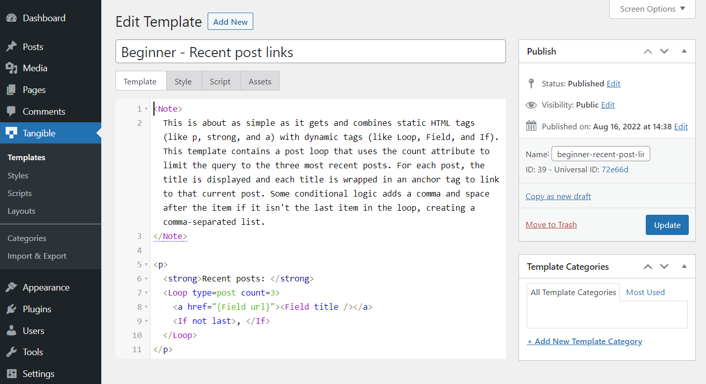
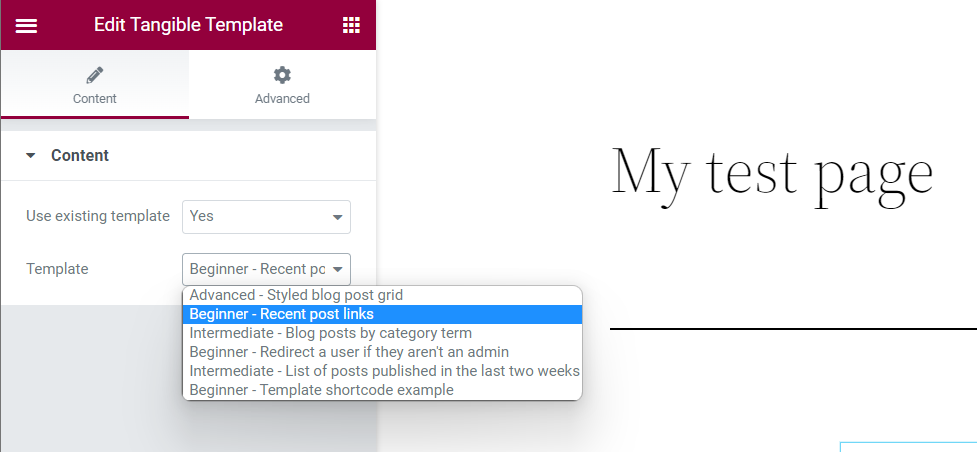

If you want to get the most out of Loops & Logic, we recommend going through [our full getting started guide](/getting-started/loops-and-logic/intro), but if you're in a rush, this guide will give you some quick demo templates to load onto your site so that you can start working with L&L.

  

## Step 1: Install Loops & Logic

In the admin dashboard of your WordPress site, navigate to Plugins > Add New, search for Loops & Logic, and click Install Now. Once it's finished installing, click Activate.

  

## Step 2: Download some demo templates

L&L templates can be shared either as .json or .png files. The .png below is an encoded collection of general L&L templates that will work with the data structure of most WordPress blogs. Save the image below to your computer.

## Step 3: Import the file into Loops & Logic

In your site's dashboard, navigate to Tangible > Import & Export and click Import. Select the .png file you just downloaded.

## Step 4: Explore the templates

You'll now have a handful of templates visible under Tangible > Templates. To view any of them, click on the post title. We recommend starting with the template called "Beginner - Recent post links."

  

Each template contains a note at the top describing how it works and some templates include inline comments to further explain how different parts of the Loops & Logic templating language work.

  

## Step 5: Add a template to a page

To render a template, it needs to be added somewhere to your site. Loops & Logic comes with a Tangible Template block for Gutenberg, a widget for Elementor, and a module for Beaver Builder. On each of these builders, adding a Tangible Template block/widget/module to the page will allow you to write L&L markup inline or select from a saved template.

### In Gutenberg

Here's what the interface looks like in Gutenberg. The Editor tab allows you to write inline L&L markup and the Saved templates tab allows you to select one of your templates to render it. To see a template's output, click Preview or view your page on the front end. 

  

### In Elementor

Here's what the interface looks like in Elementor. In the "use existing template" dropdown, selecting "no" allows you to write inline L&L markup. Selecting "yes" allows you to select one of your saved templates to render it. The template's output will be displayed in the page builder or on the front end of the site. 

  

### In Beaver Builder

Here's what the interface looks like in Beaver Builder. In the "use existing template" dropdown, selecting "no" allows you to write inline L&L markup. Selecting "yes" allows you to select one of your saved templates to render it. The template's output will be displayed in the page builder or on the front end of the site.

  

### In another page builder

Loops & Logic currently only includes blocks for the three page builders noted above, but you can still use Loops & Logic even if you use another page builder! To do this, open the template called "Beginner - Template shortcode example" and follow the included instructions to render a template using the [template id=replace_with_template_id_number] shortcode.

## Step 6: Try things!

We're strong believers in learning by doing. So play around with the templates you've downloaded and see what happens! If you'd like to get a deeper understanding of how the L&L templating language works and how you can get the most out of this plugin, we recommend going through our [beginner's guide to Loops & Logic](/getting-started/loops-and-logic/intro) to learn everything you'll need to know to build just about any template you can imagine. Happy looping!