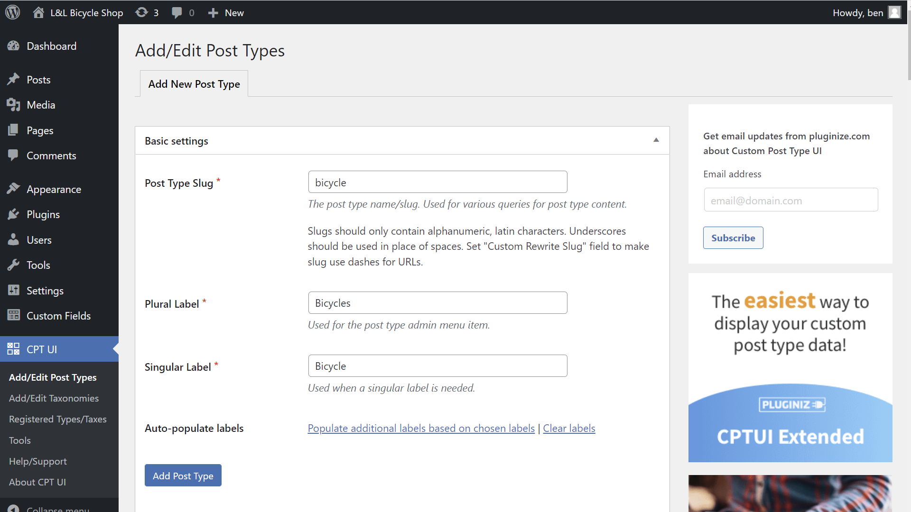
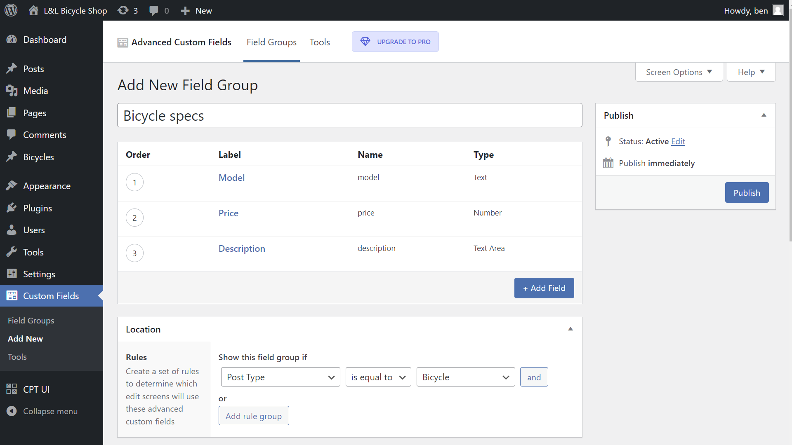
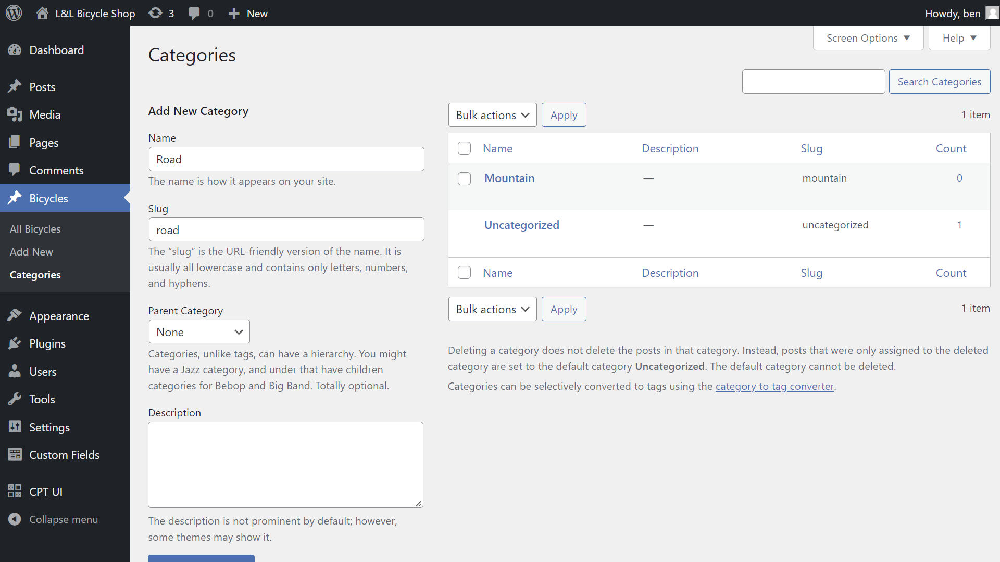
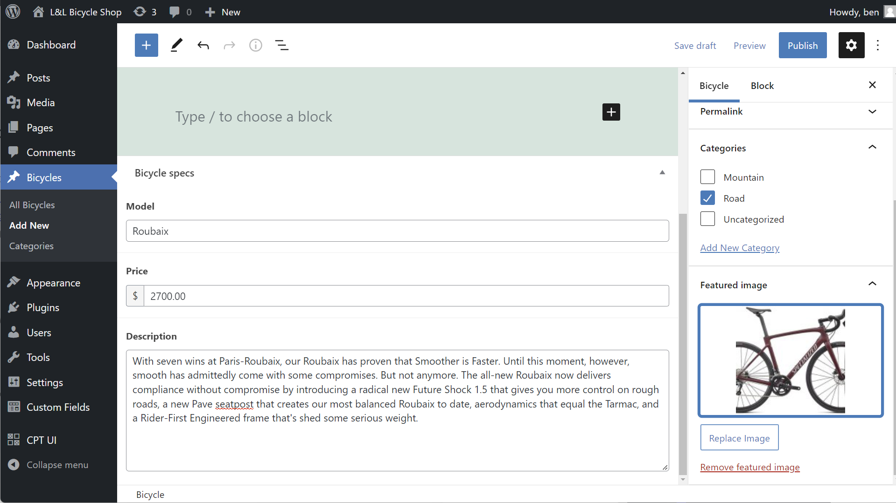
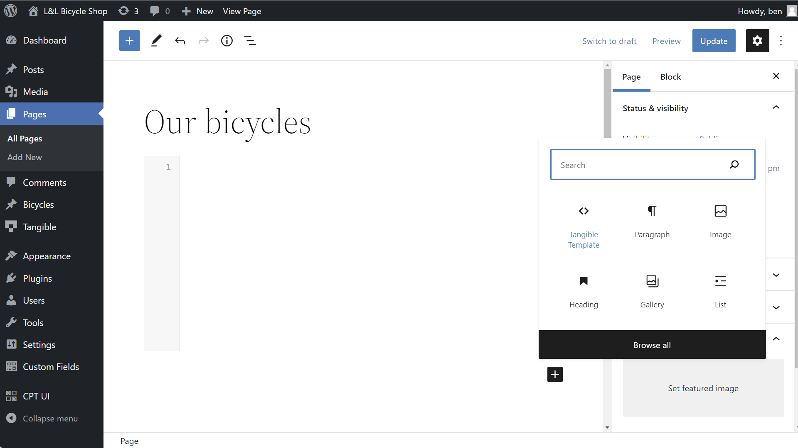
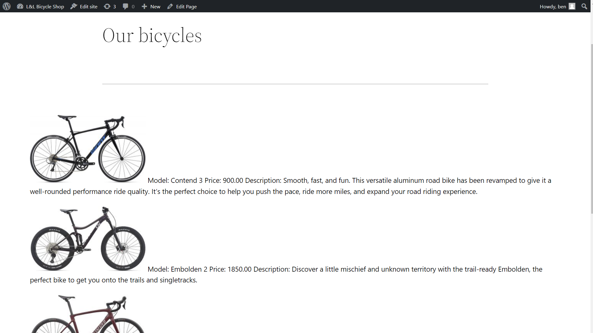

L&L is powerful enough to build entire site themes, but we’ll start by looking at a basic template example to get familiar with the fundamentals. A _template_ is the custom post type associated with Loops & Logic. Any L&L markup you write, including the code in the example below, will need to be added inside a template. Instead of sticking to default WordPress post types, we’ll make things a little more interesting by using custom fields. Let’s see it in action!

## Step 1: make some test data

If you’d like to follow along with this L&L example on your own site, feel free to add some data to a WordPress site that you can work with. You can use plugins like [Custom Post Type UI](https://wordpress.org/plugins/custom-post-type-ui) and [Advanced Custom Fields](https://wordpress.org/plugins/advanced-custom-fields) to create your own post types, taxonomies, and fields. If you're just here to see L&L in action and don't want to follow along with your own test data, skip to step 2 below.

Imagine a bicycle shop that wants to display its latest models. We'll start by creating a new post type called `bicycle`. Here we're using CPT UI to create the new post type. Be sure to enable the category taxonomy in the settings for the new post type, we'll use that later.

  

  

Next, we'll use Advanced Custom Fields to add fields to our newly-created post type such as `model`, `price`, and `description`. Be sure to set the location to the bicycle post type we just created.

  

  

Within the new post type we just made, we'll create two categories such as `mountain` and `road`.



  

We'll then add a couple of bicycle posts so that we have some data to work with.  



  

Finally, we'll create a new page to display the bicycles and add the Tangible Template block to the page using your builder of choice. Here's we'll work with Gutenberg. Adding this block to your page builder will reveal a code editor area in which you can write your template.  

  

  

Great, we've got some test data to work with! Now it's time to write some L&L markup to display some of that data.  

## Step 2: create your L&L template

Now for the fun part: displaying your content! Our bicycle shop wants to display all its models on a page. Below is a basic template written in L&L that loops through all the posts of type `bicycle` and for each post, displays fields such as the featured image, model name, price, and description.

```html
<Loop type=bicycle>
  <Field image size=medium />
  Model: <Field model />
  Price: <Field price />
  Description: <Field description />
  <br />
</Loop>
```

If you add that markup to the Tangible Template code editor and click "Preview," this should be the output using the test data we added earlier.

  

That’s all there is to it! We haven’t added any styling to our template, but already with just a few lines L&L, we’ve output our custom fields in line with some text and familiar HTML tags like `<br />`. But what is that template actually doing? Let’s take a look at it line by line to better understand its components.

## Step 3: figure out what you’ve just written

```html
<Loop type=bicycle>
```

The code starts with a `<Loop>` tag. As discussed earlier, this is a dynamic tag that instructs the server to start querying the WordPress database for a particular type of content. The `type` attribute defines the type of content that should be looped through, often a post type. In our case, we want to loop through the bicycle custom post type we created earlier, so we use `bicycle` as the value of our attribute.

```html
<Field image size=medium />
```

We’re now inside of our loop. The loop will run once for each post that matches the attributes we specified above. So if there are six posts of type `bicycle`, our loop will run six times, displaying the fields specified within the loop for all six of our posts. On this line, we’re using the `<Field />` tag to display the `image` field (the featured image) of the post that’s currently being looped through. We’ve also added a `size` attribute to specify what size of image we want to display. Just like in HTML, self-closing tags end with `/>`.

```html
Model: <Field model />
Price: <Field price />
Description: <Field description />
```

More fields! You can see that we’ve added some plain text such as Model: and Price: alongside our `<Field />` tags. In the line above, we used the standard `image` field, but we can also reference the custom fields we’ve made. Just like in standard HTML, the text will be displayed as-is on the front end of the site, whereas the dynamic tags will be replaced by the data they’re fetching.

```html
<br>
```

The good ol’ break tag! You can use all the standard HTML tags you’re familiar with in the L&L template editor.

```html
</Loop>
```

Everything that has a beginning must come to an end. This line closes the loop tag.

## Step 4: test your intuition

Starting to get the hang of things? Take a look at the L&L template below and try to picture what its output would be. Don’t worry if you’re not familiar with all the syntax yet, this is just an opportunity to test your intuitions. Copy it into a template block on the page we created above and see if you were right!

```html
<ul>
  <Loop type=bicycle category=mountain>
    <li><a href="{Field url}"><Field title /></a> - <Field model /> - <Field price /></li>
  </Loop>
</ul>
```

If you guessed that this would display an unordered list of all the mountain bikes (`bicycle` posts that are in the `mountain` category) with titles that link to the individual posts, you’d be right! Even if you’re not comfortable writing your own templates yet, we hope you can see how L&L markup can interact with standard HTML markup and how dynamic content from your site can be displayed.