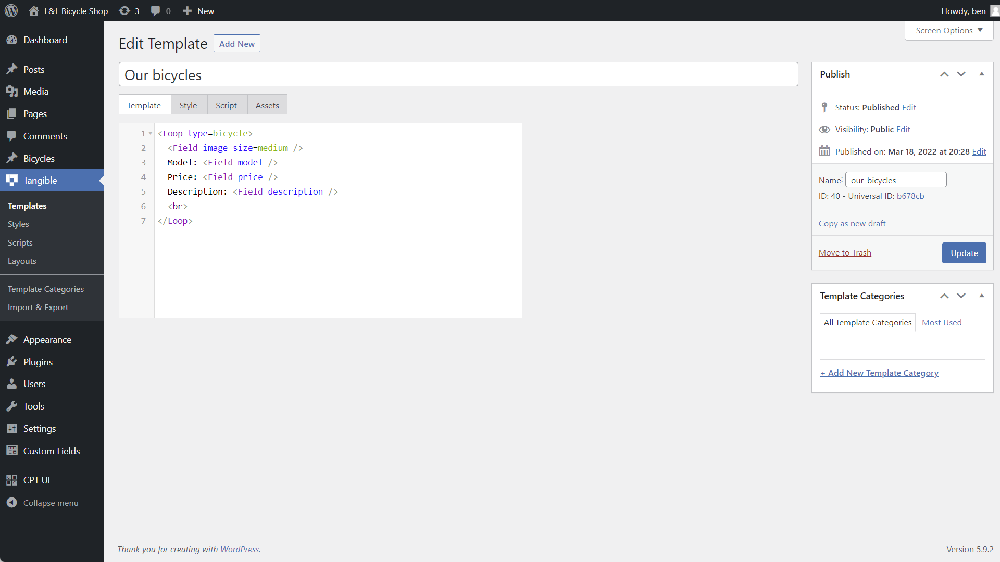
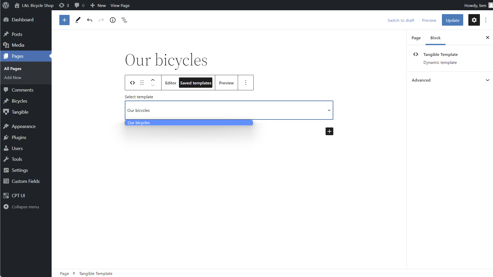
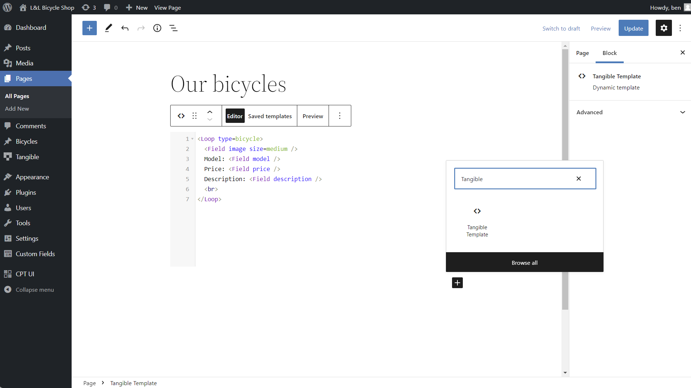

Now that you’ve seen a few dynamic tags in action, you might want to start tinkering with L&L templates on your own and learning about all the other dynamic tags available to you in the template editor. Experimentation is our favorite way to learn, but there’s one more thing to understand first: how to load an L&L template onto a page.

L&L markup won’t be parsed in the normal WordPress content area, which means that the markup needs to be written within a template and then loaded onto a page. There are two ways to write a new L&L template:

- Using a saved template post (recommended)
- Using inline markup within your page builder using the "Tangible Template" Gutenberg block, Elementor widget, or Beaver Builder module.

In the [bike shop example shown in this guide](/docs/getting-started/loops-and-logic/creating-a-simple-template), we added our L&L directly to an inline Tangible Template block in Gutenberg. This method is a convenient way to add a small piece of one-off L&L markup but isn’t a great way to build reusable, shareable, styled L&L templates. In most cases, we recommend writing your L&L into a saved template post. Below we'll discuss how each of these methods work and why you might choose to use one or the other.

## Writing a template using a saved template post

To get the most out of L&L, we generally recommend using the post type included with L&L (called "template") to write your markup. Creating templates not only makes it easier to export and reuse templates throughout your site, but it also adds the style, script, and assets tabs (shown in the screenshot below) to save your CSS, SASS, Javascript, and assets alongside your template. In addition to being able to use these extra features, creating saved templates allows you to use [the `Template` tag](/docs/learning-guides/dynamic-tags/template) to refer to one template inside another template. Working with nesting templates allows you to write [DRYer code](https://en.wikipedia.org/wiki/Don%27t_repeat_yourself) and use HTML and L&L as an object-oriented language, opening up powerful structured site-building workflows like creating your own [design system](https://bradfrost.com/blog/post/atomic-web-design/). To create a new template post, head to the dashboard of your WordPress site and navigate to Tangible > Tangible > Templates, then click "Add new." Here's what the template editor interface looks like, where you'll see useful tabs like Style, Script, and Assets, as well as a place to write your template.

  

When working with saved templates, there are three ways of getting a template you've written to show up on a page on your site:

- Using the Tangible Template block (recommended)
- Using the `[template]` shortcode
- Using the `tangible_template()` PHP function

### Displaying a saved template with the Tangible Template block

If you use one of the three currently-supported page builders (Gutenberg, Elementor, or Beaver Builder), we recommend adding your saved template to a page using the Tangible Template block in your page builder. As shown in the screenshot below in Gutenberg, the Tangible Template block has a tab that allows you to select which of your saved templates you'd like to display. Here, we're selecting the "Our bicycles" template from earlier.

  

### Displaying a saved template with the `[template]` shortcode

If you don't use one of the three supported builders or if you want to render a template on a part of your site that doesn't support blocks (such as Beaver Builder's Custom Post Layout editor), [the `[template]` shortcode](/docs/learning-guides/dynamic-tags/template#shortcode) is a convenient tool. Continuing to use the same saved template from above as our example, we could render this template on a page by writing `[template id=30]` into any text area in WordPress that accepts shortcodes. The template post ID number can be found next to the saved template under Tangible > Templates in the WordPress admin or within the template post itself just under the slug in the Publish menu (shown on the right in the first screenshot on this page). This isn't the preferred method because disabling or uninstalling Loops & Logic from your WordPress site would leave unrendered plain-text shortcodes on your pages.  

### Displaying a saved template with the `tangible_template()` PHP function

The final way to display a template is using [the `tangible_template()` PHP function](/docs/learning-guides/dynamic-tags/template#from-php). To render our bicycle template directly, we would use `echo tangible_template('<Template id=30 />');`.

## Writing a template using inline markup in your page builder

If all you need is a few quick lines of L&L to display some information and you aren't intending to reuse your template elsewhere, it's possible to write templates inline within the supported page builders using the Tangible Template block. The screenshot below shows some L&L markup written directly on a Gutenberg page called "Our bicycles." While this is a quick way to write and preview short templates, working with the block doesn't allow you to use the Style, Script, or Assets tab or any of the more advanced workflows mentioned above. We recommend using the editor for quick tests or one-off templates, but avoiding it for larger templates and full page/site builds.

