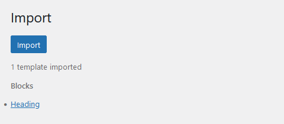

The Import & Export tool enables the import and export of blocks, templates, styles, scripts or layouts via .json files. It can be found in the WordPress Admin under **Tangible > Import & Export**.

The export functionality provides a selection interface so you can collect any of the templates on your site into an export package. If you don't provide an alternative package name, the package will be exported with the name **tangible-templates-yyyymmdd.json** with the current date appended to the filename.  

  

The import functionality simply allows the upload of .json export files. Once the file has been imported, the tool will list all of the templates that have been imported for reference.

  

If the tool detects that your upload file contains a duplicate of an existing template, it will provide a warning and prompt a decision about how to treat the duplicate. Selecting "Overwrite" will replace the existing version with the new one. Selecting "Keep both" will rename the new file so as to not overwrite the original. Selecting "Skip" will skip the duplicate template.

That's it! You now have all the understanding you need to start writing and displaying your own templates. There are so many more powerful dynamic tags that we haven't introduced in this beginner's guide, so go [discover the dynamic tags available in the L&L templating language](/dynamic-tags) and get creative!