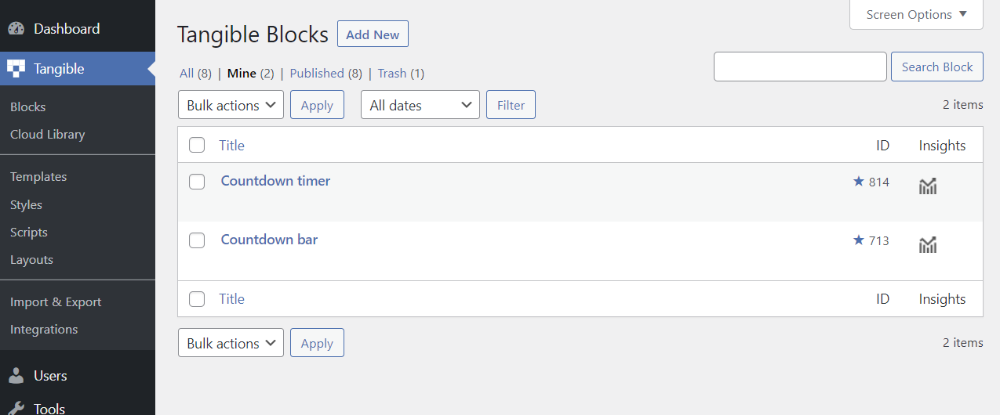

# What is a block?

Nearly identical to templates in the Loops & Logic plugin, our Tangible Blocks plugin uses a custom post type called _block_. L&L markup can be added to a block in the exact same way as it’s added to a template, but blocks have an additional tab called Controls that allows you to build page builder controls for the block, allowing you to create user-friendly blocks using simple L&L markup.

