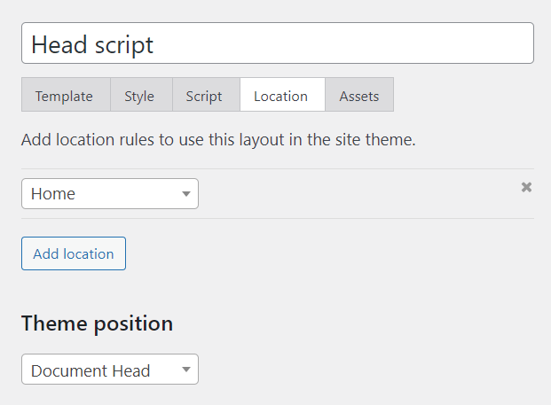

Use the `JSON-LD` tag to create structured data that can be added to the `head` of a web page and used by search engines and other tools to better understand the content of your page.

## Overview

The `JSON-LD` tag accepts data in the exact same way as [the `Map` tag](/docs/learning-guides/dynamic-tags/map), allowing you to add key-value pairs using the `Key` tag, lists (also called arrays) using the `List` tag, or maps (also called associate arrays) using the `Map` tag.

Unlike the `Map` tag, the `JSON-LD` tag doesn't save its value, but instead renders it as a properly formatted JSON-LD script.

For example, the structured data below contains several key-value pairs, a list, and a child map.

```markup
<JSON-LD>
  <Key id value="http://www.wikidata.org/entity/Q76" />
  <Key type value="Person" />
  <Key name value="John Doe" />
  <List images>
    <Item>https://example.com/image-1</Item>
    <Item>https://example.com/image-2</Item>
  </List>
  <Map spouse>
    <Key id value="http://www.wikidata.org/entity/Q13133" />
    <Key type value="Person" />
    <Key name value="Jane Doe" />      
  </Map>
</JSON-LD>
```

The keys, lists, and maps in the template above could also be generated dynamically with any of the available dynamic tags, but this example demonstrates static content for the sake of simplicity. The template above would generate the following schema.

```markup
{
  "@context": "http://schema.org",
  "id": "http://www.wikidata.org/entity/Q76",
  "type": "Person",
  "name": "John Doe",
  "images": [
    "https://example.com/image-1",
    "https://example.com/image-2"
  ],
  "spouse": {
    "id": "http://www.wikidata.org/entity/Q13133",
    "type": "Person",
    "name": "Jane Doe"
  }
}
```

## Adding schema to your site's head

The main purpose of this tag is to more easily generate dynamic schema to be placed in the head of your document. To do this, the `JSON-LD` tag can be placed in a Layout template with the theme position set to “Document Head”.

