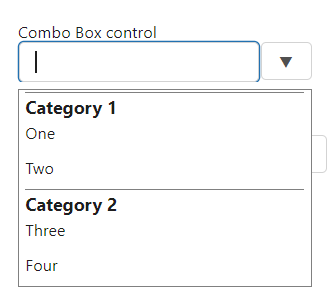
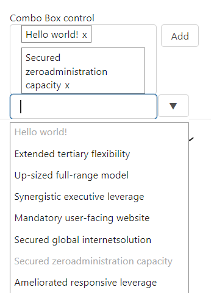
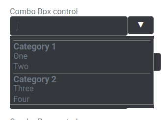
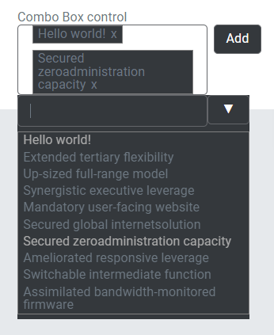
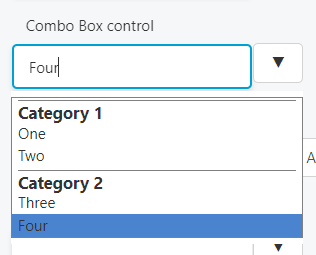
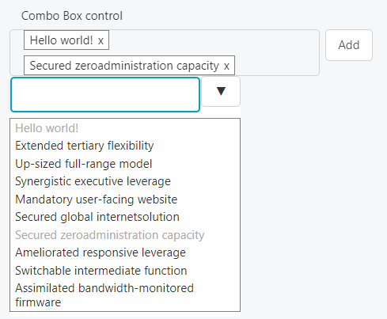

This control creates a searchable select field.

Below is an example of a simple combo box field.

```html
<Control type="combo_box" name="combo_box_name" label="Combo Box control">
  <Map choices>
    <Key one>One</Key>
    <Key two>Two</Key>
    <Key three>Three</Key>
  </Map>
</Control>
```

Here is an example of a combo box with multiple maps to create a more structured hierarchy.

```html
<Control type="combo_box" name="combo_box_name" label="Combo Box control">
  <List name=choices>
    <Map>
      <Key name>Theme Colors</Key>
      <Map choices>
        <Key one>One</Key>
        <Key two>Two</Key>
      </Map>
    </Map>
    <Map>
      <Key name>Fun Colors</Key>
      <Map choices>
        <Key three>Three</Key>
        <Key four>Four</Key>
      </Map>
    </Map>
  </List>
</Control>
```

Here is an example of a combo box with an async search and multi-select enabled.

```html
<Control type="combo_box" name="combo_box_name" label="Combo Box control" is_async="true" multiple="true">
  <Key search_url>https://mysite.com/wp-json/wp/v2/search</Key>
  <Map async_args>
    <Key subtype>post</Key>
  </Map>
</Control>
```

## Attributes

- `default` - Defines the default value of the control.  
    Type: string
- `is_async` - If true, the control will render async search results   
    Type: boolean
- `label` - Defines the label of the control which will be displayed in the page builder.  
    Type: string
- `multiple` - If true, users will be able to select multiple options.  
    Type: boolean
- `name` - Defines the name of the control which will be referenced to render the control value.  
    Type: string

## Rendering the control value

The value can be rendered in a template, style, or script.

In a template, use `Get` or `Loop` to render the control value.

```html
<Get control=combo_box_name />

<Loop control=combo_box_name>
  <Field value />
</Loop>
```

In a style, use the standard syntax to refer to SASS variables.

```scss
.style {
  --theme-palette1: #abcde0;
  --theme-palette2: #0a72ee;
  --fun-color1: #ee27a0;
  --fun-color2: #d8d83a;
  
  background-color: var(--#{$combo_box_name});
}
```

In a script, use the standard syntax to refer to JS variables.

```js
console.log(combo_box_name);
```

## Preview

### In Gutenberg

       

### In Elementor

       

### In Beaver Builder

     