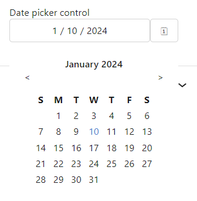
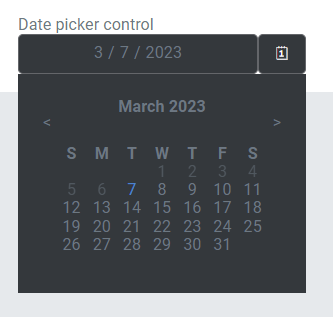
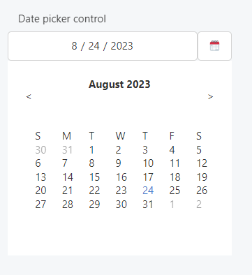

This control creates a date selection interface.

```html
<Control type="date_picker" name="date_picker_name" label="Date picker control" format="d/m/y" />
```

## Attributes

- `default` - Defines the default value of the control.  
    Type: string  
    
- `format` - Defines the format of the date's value.  
    Type: string  
    Default: `d/m/Y`
- `label` - Defines the label of the control which will be displayed in the page builder.  
    Type: string  
    
- `name` - Defines the name of the control which will be referenced to render the control value.  
    Type: string  
    

## Rendering the control value

The value can be rendered in a template, style, or script.

In a template, use `Get` or `Loop` to render the control value.

```html
<Get control=date_picker_name />

<Loop control=date_picker_name>
  <Field value />
</Loop>
```

For example, you can have a template that is displaying a calendar and you want to highlight a specific date:

```html
<Loop control=date_picker_name>
  <div class="my-date" data-date="{Field value}">
    <Field value />
  </div>
</Loop>
```

In a style, use the standard syntax to refer to SASS variables.

```scss
time[datetime="#{$date_picker_name}"] {
  color: red;
}
```

In a script, use the standard syntax to refer to JS variables.

```js
console.log(date_picker_name);
```

## Preview

### In Gutenberg

  

### In Elementor

  

### In Beaver Builder

