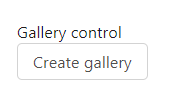
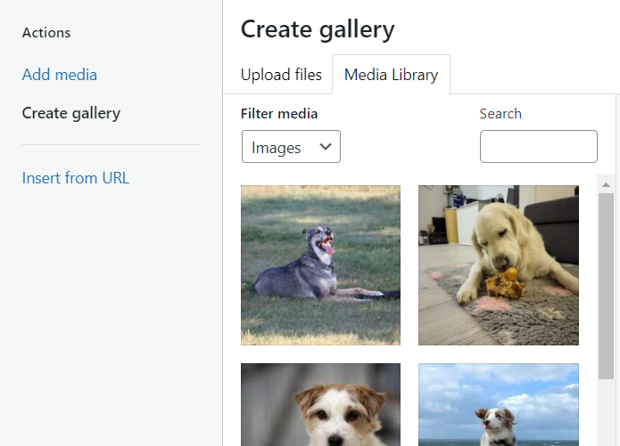
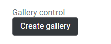
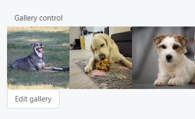

This control creates an image upload and selection interface.

```html
<Control type="gallery" name="gallery_name" label="Gallery control" />
```

## Attributes

- `default` - Defines the default value of the control of specifying attachment ID(s).  
    Type: string
- `label` - Defines the label of the control which will be displayed in the page builder.  
    Type: string  
    
- `name` - Defines the name of the control which will be referenced to render the control value.  
    Type: string  
    
- `size` - Defines the size of the images  
    Type: string  
    Default: `full`  
    
- `wp_media` - Enables or disables the ability to select media from the WordPress gallery  
    Type: boolean  
    Default: `true`

## Rendering the control value

The value can be rendered in a template using `Loop` to loop through the image fields. See the [attachment loop](/docs/learning-guides/dynamic-tags/loop/attachment) for available fields.

```html
<Loop control=gallery_name>
  <ul>
    <li>ID: <Field id /></li>
    <li>URL: <Field url /></li>
    <li>Alt: <Field alt /></li>
    <li>Title: <Field title /></li>
    <li>Caption: <Field caption /></li>
    <li>Description: <Field description /></li>
  </ul>
</Loop>
```

## Preview

### In Gutenberg

     

### In Elementor

  

### In Beaver Builder

