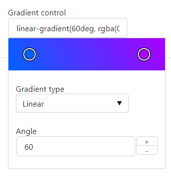
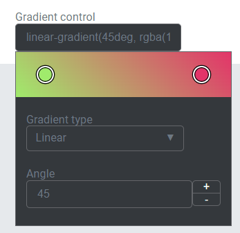
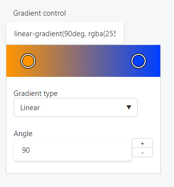

This control creates a gradient color selection interface.

```html
<Control type="gradient" name="gradient_name" label="Gradient control" />
```

## Attributes

- `default` - Defines the default value of the control.  
    Type: string
- `label` - Defines the label of the control which will be displayed in the page builder.  
    Type: string  
    
- `name` - Defines the name of the control which will be referenced to render the control value.  
    Type: string  
    

## Rendering the control value

The value can be rendered in a template, style, or script.

In a template, use `Get` or `Loop` to render the control value.

```html
<Get control=gradient_name />

<Loop control=gradient_name>
  <ul>
    <li>Value: <Field value/></li>
    <li>Type: <Field type/></li>
    <li>Angle: <Field angle/></li>
    <li>Shape: <Field shape/></li>
    <li>Color: <Field colors/></li>
  </ul>
</Loop>
```

In a style, use the standard syntax to refer to SASS variables.

```scss
.style {
  background-image: $gradient_name;
}
```

In a script, use the standard syntax to refer to JS variables.

```js
console.log(gradient_name);
```

### Fields

- `value` - Value of the control.
- `type` - Type of gradient, either linear, radial, or conical.
- `angle` - Angle of the gradient if type is linear.
- `shape` - Shape of the gradient if type is radial.
- `colors` - Colors in the gradient expressed as a list of RGBA values.

## Preview

### In Gutenberg

  

### In Elementor

  

### In Beaver Builder

