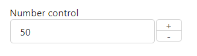
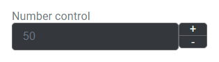
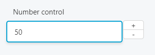

This control creates a number field that can be increased or decreased.

```html
<Control type="number" name="number_control_name" label="Number control" min="0" max="100">
  <Key default>50</Key>
<Control>
```

## Attributes

- `default` - Defines the default value of the control.  
    Type: string
- `label` - Defines the label of the control which will be displayed in the page builder.  
    Type: string  
    
- `max` - The highest number that can be selected.  
    Type: number
- `min` - The lowest number that can be selected.  
    Type: number
- `name` - Defines the name of the control which will be referenced to render the control value.  
    Type: string  
    

## Rendering the control value

The value can be rendered in a template, style, or script.

In a template, use `Get` or `Loop` to render the control value.

```html
<Get control=number_control_name />

<Loop control=number_control_name>
  <Field value />
</Loop>
```

In a style, use the standard syntax to refer to SASS variables.

```scss
.style {
  opacity: $number_control_name;
  display: grid;
  grid-template-columns: repeat($number_control_name, 1fr);
  border-radius: $number_control_name * 1px;
}
```

In a script, use the standard syntax to refer to JS variables.

```js
console.log(number_control_name);
```

## Preview

### In Gutenberg

  

### In Elementor

  

### In Beaver Builder

