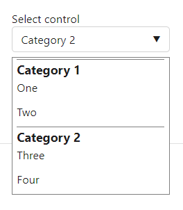
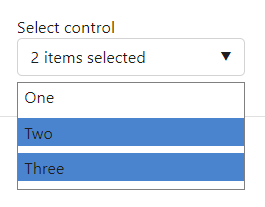
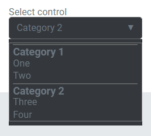
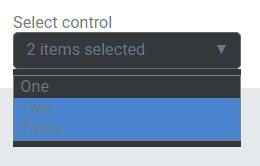
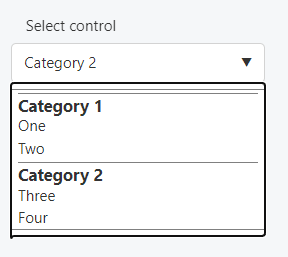
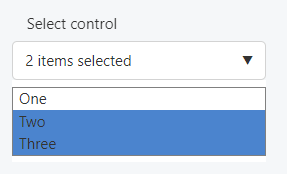

This control creates a select field.

Below is an example of a select control with the ability to select multiple options.

```html
<Control type="select" name="select_name" label="Select control" multiple="true">
  <Map choices>
    <Key one>One</Key>
    <Key two>Two</Key>
    <Key three>Three</Key>
  </Map>
</Control>
```

Here is an example of a select control with multiple maps to create a more structured hierarchy.

```html
<Control type="select" name="select_name" label="Select control">
  <List name=choices>
    <Map>
      <Key name>Category 1</Key>
      <Map choices>
        <Key one>One</Key>
        <Key two>Two</Key>
      </Map>
    </Map>
    <Map>
      <Key name>Category 2</Key>
      <Map choices>
        <Key three>Three</Key>
        <Key four>Four</Key>
      </Map>
    </Map>
  </List>
</Control>
```

## Attributes

- `default` - Defines the default value of the control.  
    Type: string
- `label` - Defines the label of the control which will be displayed in the page builder.  
    Type: string
- `multiple` - If true, users will be able to select multiple options.  
    Type: boolean
- `name` - Defines the name of the control which will be referenced to render the control value.  
    Type: string
- `options` - Defines the value and label of the options.  
    Type: map

## Rendering the control value

The value can be rendered in a template, style, or script.

In a template, use `Get` or `Loop` to render the control value.

```html
<Get control=select_name />

<Loop control=select_name>
  <Field value />
</Loop>
```

In a style, use the standard syntax to refer to SASS variables. Note that this example works with only one item selected.

```scss
.style {
  display: flex;
  justify-content: #{$select_name};
}
```

In a script, use the standard syntax to refer to JS variables.

```js
console.log(select_name);
```

## Preview

### In Gutenberg

     

### In Elementor

       

### In Beaver Builder

     