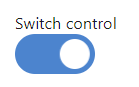
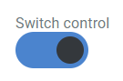
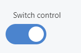

This control creates a switch that can be toggled on and off.

```html
<Control type="switch" name="switch_name" label="Switch control" />
```

## Attributes

- `default` - Defines the default value of the control.  
    Type: string  
    
- `label` - Defines the label of the control which will be displayed in the page builder.  
    Type: string  
    
- `name` - Defines the name of the control which will be referenced to render the control value.  
    Type: string  
    
- `value_off` - Value returned when the switch is disabled.  
    Type: string  
    Default: `off`  
    
- `value_on` - Value returned when the switch is enabled.  
    Type: string  
    Default: `on`

## Rendering the control value

The value can be rendered in a template, style, or script.

In a template, use `Get` or `Loop` to render the control value.

```html
<Get control=switch_name />

<Loop control=switch_name>
  <Field value />
</Loop>
```

In a style, use the standard syntax to refer to SASS variables. In order for this example to work we need to set the values as `value_off="hidden"` and `value_on="visible"` .

```scss
.style {
  visibility: #{$switch_name};
}
```

In a script, use the standard syntax to refer to JS variables.

```js
console.log(switch_name);
```

## Preview

### In Gutenberg

  

### In Elementor

  

### In Beaver Builder

