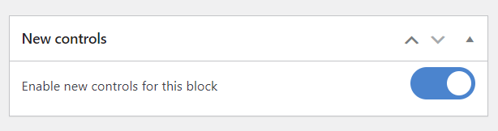

Learn the syntax and accepted attributes for block controls in Tangible Blocks

The Editor add-on for Tangible Blocks adds a "Controls" tab to the template editor to enable building universal blocks using the L&L templating language. A block created in the Tangible Blocks Editor plugin automatically becomes a Gutenberg block, Elementor widget, and Beaver Builder module.

## Controls

Tangible Blocks Editor adds a `Control` tag that enables building a variety of control types for page builders.

### Control types

Here are the available control types.

- [Button group](/docs/learning-guides/tangible-blocks/block-controls/button-group)
- [Checkbox](/docs/learning-guides/tangible-blocks/block-controls/checkbox)
- [Color picker](/docs/learning-guides/tangible-blocks/block-controls/color)
- [Combo box](/docs/learning-guides/tangible-blocks/block-controls/combo-box)
- [Date picker](/docs/learning-guides/tangible-blocks/block-controls/date)
- [Dimensions](/docs/learning-guides/tangible-blocks/block-controls/dimensions)
- [Field group](/docs/learning-guides/tangible-blocks/block-controls/field-group)
- [File](/docs/learning-guides/tangible-blocks/block-controls/file)
- [Gallery](/docs/learning-guides/tangible-blocks/block-controls/gallery)
- [Gradient](/docs/learning-guides/tangible-blocks/block-controls/gradient)
- [Number](/docs/learning-guides/tangible-blocks/block-controls/number)
- [Radio](/docs/learning-guides/tangible-blocks/block-controls/radio)
- [Repeater](/docs/learning-guides/tangible-blocks/block-controls/repeater)
- [Select](/docs/learning-guides/tangible-blocks/block-controls/select)
- [Switch](/docs/learning-guides/tangible-blocks/block-controls/switch)
- [Text](/docs/learning-guides/tangible-blocks/block-controls/text)
- [Text suggestion](/docs/learning-guides/tangible-blocks/block-controls/text-suggestion)
- [WYSIWYG](/docs/learning-guides/tangible-blocks/block-controls/wysiwyg)  

### Attributes

All controls have the following common attributes.

- `type` - Control type
- `name` - Name of control field: This corresponds to the placeholder name
- `label` - Control label
- `default` - Default value

The first three are required.

Control attributes can be defined like this.

```html
<Control type="text" name="control-name" label="label" default="default" />
```

Or it can also be defined using the `Key` tag.

```html
<Control>
  <Key type>text</Key>
  <Key name>control-name</Key>
</Control>
```

This can be useful for passing dynamic values or long text.

## Displaying a control value

The control values that a user enters (or selects) in the page builder can be referenced as variables in the block's template, style, or script. The syntax used to render the control value may differ depending on the control, so refer to the specific control page (linked above) for further details.

In general, controls containing only one value are referenced in the template using the `Get` tag.

```html
<Get control=my_control_name />
```

Controls containing multiple values are referenced in the template using the `Loop` tag.

```html
<Loop control=my_control_name>
  <Field value />
</Loop>
```

In a style, use the standard syntax to refer to SASS variables.

```css
.style {
  color: $my_control_name;
}
```

In a script, use the standard syntax to refer to JS variables.

```js
console.log(my_control_name);
```

## Control features

Here are a few features of block controls in the Tangible Blocks Editor.

- [Sections and tabs](/docs/learning-guides/tangible-blocks/block-controls/features/sections-tabs)
- [Control visibility](/docs/learning-guides/tangible-blocks/block-controls/features/control-visibility)
- [Bases](/docs/learning-guides/tangible-blocks/block-controls/features/bases)
- [Aliases](/docs/learning-guides/tangible-blocks/block-controls/features/aliases)

## Transitioning from legacy controls

As of Tangible Blocks version 3.1.6, [legacy controls](/docs/learning-guides/tangible-blocks/legacy-controls/) are being phased out along with the syntax used to display the value of these legacy controls. The new controls linked above now rely on native javascript within Tangible Blocks instead of relying on the page builder's own controls, which will allow much greater consistency between builders moving forward. The new syntax is also much more flexible and allows looping through multiple control values, which wasn't possible with the old `{{ control_name }}` syntax.

To use the new controls and syntax, simply enable this switch in the meta box at the bottom of your block template.

  

It is not possible to use both legacy and new controls on the same block. However, it is possible to use both legacy and new blocks on the same page in your editor.

In legacy mode, either the old syntax `{{ control_name }}` or the new syntax `<Get control=my_control_name />` mentioned above can be used. When new controls are enabled for a block, only the new syntax is supported.

Updating directly from legacy controls to new controls in an existing block is not recommended, since any previously saved values associated with that block in your page builder might have a different format than the one expected by new controls. The safe way to migrate a block is to create a new one.