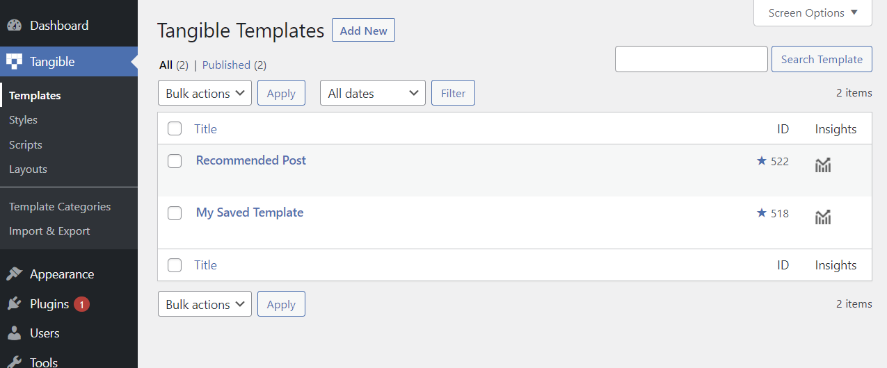

In the same way that a WooCommerce shop uses the ‘product’ post type and a WordPress blog uses the ‘post’ post type, Loops & Logic uses a custom post type called _template_. L&L markup is always written within a template, whether that’s in the WP admin under Tangible > Templates or directly in a page builder using the Tangible Template block.

