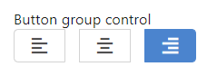
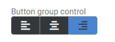
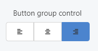

This control creates one or more buttons that can contain text or icons.

```html
<Control type="button_group" name="button_group_name" label="Button group control" use_dashicon="true">  <Map choices>
    <Key left>editor-alignleft</Key>
    <Key center>editor-aligncenter</Key>
    <Key right>editor-alignright</Key>
  </Map>
</Control>
```

## Attributes

- `default` - Defines the default value of the control by referencing one of the keys (such as `left` or `center` in the example template above).  
    Type: string  
    
- `label` - Defines the label of the control which will be displayed in the page builder.  
    Type: string  
    
- `name` - Defines the name of the control which will be referenced to render the control value.  
    Type: string  
    
- `use_dashicon` - If true, buttons will display an icon instead of text by passing the icon name in the value of each `Key`. [Browse the Dashicons library here](https://developer.wordpress.org/resource/dashicons/) for a complete list of available icons.
Type: boolean

## Rendering the control value

The value can be rendered in a template, style, or script.

In a template, use `Get` or `Loop` to render the control value.

```html
<Get control=button_group_name />

<Loop control=button_group_name>
  <Field value />
</Loop>
```

In a style, use the standard syntax to refer to SASS variables.

```css
.style {
  text-align: #{$button_group_name};}
```

In a script, use the standard syntax to refer to JS variables.

```js
console.log(button_group_name);
```

## Preview

### In Gutenberg

  

### In Elementor

  

### In Beaver Builder

