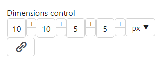
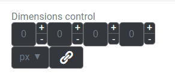
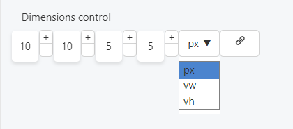

This control creates an interface to set vertical and horizontal dimensions.

```html
<Control type="dimensions" name="dimensions_name" label="Dimensions control">
  <List units>
    <Item>px</Item>          
    <Item>vw</Item>          
    <Item>vh</Item>          
  </List>
</Control>
```

## Attributes

- `default` - Defines the default value of the control.  
    Type: string  
    Default: `0,0,0,0` (if `multiple_values` is `false`, the default is `0`)
- `default_unit` - Defines the default unit used in the control.  
    Type: string  
    Default: `px`  
    
- `label` - Defines the label of the control which will be displayed in the page builder.  
    Type: string  
    
- `multiple_values` - If true, the control has four dimension values instead of one  
    Type: boolean  
    Default: `true`  
    
- `name` - Defines the name of the control which will be referenced to render the control value.  
    Type: string  
    
- `units` - Defines the type of units available in the control  
    Type: string  
    Default: `px`  
    

## Rendering the control value

The value can be rendered in a template, style, or script.

In a template, use `Get` or `Loop` to render the control value.

```html
<Get control=dimensions_name />

<Loop control=dimensions_name>
  <ul class="card">
    <li>Full: <Field value /></li>
    <li>Top: <Field top /><Field unit /></li>
    <li>Right: <Field right /><Field unit /></li>
    <li>Bottom: <Field bottom /><Field unit /></li>
    <li>Left: <Field left /><Field unit /></li>
  </ul>
</Loop>
```

In a style, use the standard syntax to refer to SASS variables.

```scss
$dimensions_name_unit: map_get($dimensions_name-map, 'unit');

.card {
  padding: $dimensions_name;
  margin-top: map_get($dimensions_name-map, 'top')#{$dimensions_name_unit};
  margin-bottom: map_get($dimensions_name-map, 'bottom')#{$dimensions_name_unit};
}
```

In a script, use the standard syntax to refer to JS variables.

```js
console.log(dimensions_name);
```

## Preview

### In Gutenberg

  

### In Elementor

  

### In Beaver Builder

