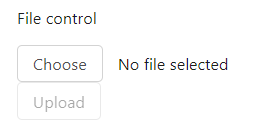
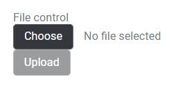
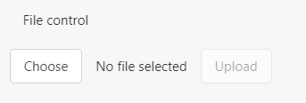

This control creates a file upload interface.

```html
<Control type="file" name="file_name" label="File control" />
```

## Attributes

- `default` - Defines the default value of the control.  
    Type: string
- `label` - Defines the label of the control which will be displayed in the page builder.  
    Type: string  
    
- `max_upload` - Defines the maximum number of files that can be added.  
    Type: number
- `name` - Defines the name of the control which will be referenced to render the control value.  
    Type: string  
    

## Rendering the control value

The value can be rendered in a template using `Loop` to loop through the file fields. See the [attachment loop](/dynamic-tags/loop/attachment) for available fields.

```html
<Loop control=file_name>
  <ul>
    <li>ID: <Field id /></li>
    <li>URL: <Field url /></li>
    <li>Alt: <Field alt /></li>
    <li>Title: <Field title /></li>
    <li>Caption: <Field caption /></li>
    <li>Description: <Field description /></li>
  </ul>
</Loop>
```

In a style, use the standard syntax to refer to SASS variables.

```scss
.style {
  background-image: url('#{$file_name}');
}
```

## Preview

### In Gutenberg

  

### In Elementor

  

### In Beaver Builder

