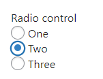
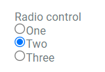
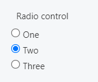

This control creates a list of options of which only one can be selected.

```html
<Control type="radio" name="radio_name" label="Radio control">
  <Map choices>
    <Key one>One</Key>
    <Key two>Two</Key>
    <Key three>Three</Key>
  </Map>
</Control>
```

## Attributes

- `default` - Defines the default value of the control.  
    Type: string  
    
- `label` - Defines the label of the control which will be displayed in the page builder.  
    Type: string  
    
- `name` - Defines the name of the control which will be referenced to render the control value.  
    Type: string  
    

## Rendering the control value

The value can be rendered in a template, style, or script.

In a template, use `Get` or `Loop` to render the control value.

```html
<Get control=radio_name />

<Loop control=radio_name>
  <Field value />
</Loop>
```

In a style, use the standard syntax to refer to SASS variables.

```scss
.style {
  display: flex;
  justify-content: $radio_name;
}
```

In a script, use the standard syntax to refer to JS variables.

```js
console.log(radio_name);
```

## Preview

### In Gutenberg

  

### In Elementor

  

### In Beaver Builder

