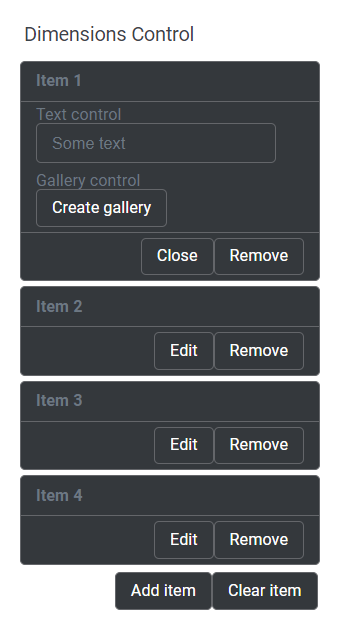

This control creates a repeatable group of inner controls.

```html
<Control type="repeater" layout="block" name="repeater_name" label="Dimensions control">
  <Control type="text" name="text_name" label="Text control" />
  <Control type="gallery" name="gallery_name" label="Gallery control" />
</Control>
```

## Attributes

- `label` - Defines the label of the control which will be displayed in the page builder.  
    Type: string  
    
- `layout` - Defines the layout of the control such as `block` and `bare` 
- `name` - Defines the name of the control which will be referenced to render the control value.  
    Type: string

## Rendering the control value

The value can be rendered in a template using `Loop` to loop through the values of the inner controls.

```html
<Loop control=repeater_name>
  <ul>
    <li>Text: <Field text_name /></li>
    <Loop control=gallery_name>
      <li>ID: <Field id /></li>
      <li>URL: <Field url /></li>
    </Loop>
  </ul>
  <hr />
</Loop>
```

## Preview

### In Gutenberg

  

### In Elementor

  

### In Beaver Builder

