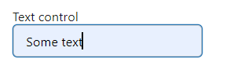
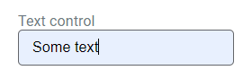
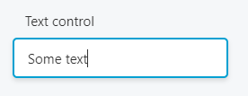

This control creates a text field.

```html
<Control type="text" name="text_name" label="Text control" />
```

## Attributes

- `default` - Defines the default value of the control.  
    Type: string  
    
- `label` - Defines the label of the control which will be displayed in the page builder.  
    Type: string  
    
- `name` - Defines the name of the control which will be referenced to render the control value.  
    Type: string  
    

## Rendering the control value

The value can be rendered in a template, style, or script.

In a template, use `Get` or `Loop` to render the control value.

```html
<Get control=text_name />

<Loop control=text_name>
  <Field value />
</Loop>
```

In a style, use the standard syntax to refer to SASS variables.

```scss
.style {
  color: #{$text_name};
}
```

In a script, use the standard syntax to refer to JS variables.

```js
console.log(text_name);
```

## Preview

### In Gutenberg

  

### In Elementor

  

### In Beaver Builder

