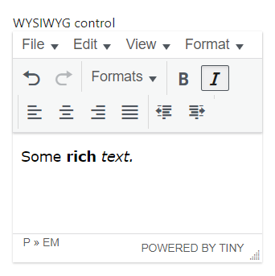
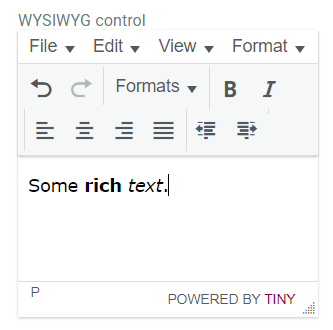
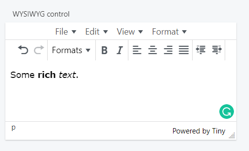

This control creates a rich text field.

```html
<Control type="wysiwyg" name="wysiwyg_name" label="WYSIWYG control" />
```

## Attributes

- `default` - Defines the default value of the control. Accepts an HTML value.  
    Type: string  
    
- `label` - Defines the label of the control which will be displayed in the page builder.  
    Type: string  
    
- `name` - Defines the name of the control which will be referenced to render the control value.  
    Type: string  
    

## Rendering the control value

The value can be rendered in a template. Use `Get` or `Loop` to render the control value.

```html
<Get control=wysiwyg_name />

<Loop control=wysiwyg_name>
  <Field value />
</Loop>
```

## Preview

### In Gutenberg

  

### In Elementor

  

### In Beaver Builder


